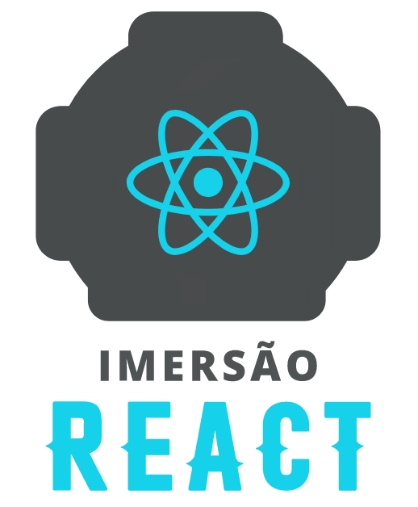

# Projeto da Imersão React

</img>

# Aluraflix

O Aluraflix foi criado acompanhando a Imersão React com base na Netflix, o evento que foi oferecido pela Alura. 

## Alura
 A Alura é a maior plataforma brasileira que oferece cursos de tecnologia com conteúdos 100% em português.

[Alura](https://www.alura.com.br/planos-cursos-online?gclid=Cj0KCQjw6575BRCQARIsAMp-ksMBIu4gCj4okGXOioZID0WTWUK4hCh7VtE41VBOKXg_EU4Lq4sRhK8aAk6oEALw_wcB)

## Tecnologias e Ferramentas utilizadas
- [x] React
- [x] eslint
- [x] prop-types
- [x] react-router-dom
- [x] styled-components
- [x] Vercel
- [x] Heroku
- [x] Git e github
- [x] Node
- [x] NPM

## Autores e instrutores da Imersão React

* Mario Souto - [Linkedin](https://www.linkedin.com/in/omariosouto/) [Twitter](https://twitter.com/omariosouto) [Instagram](https://www.instagram.com/omariosouto/)
* Juliana Negreiros - [Linkedin](https://www.linkedin.com/in/juliananegreiros/) [Twitter](https://twitter.com/juunegreiros) [Instagram](https://www.instagram.com/juu_negreiros/)
* Marco Bruno - [Linkedin](https://www.linkedin.com/in/marcobrunobr/) [Twitter](https://twitter.com/marcobrunodev) [Instagram](https://www.instagram.com/marcobrunodev/)
* Paulo Silveira - [Linkedin](https://www.linkedin.com/in/paulosilveira/) [Twitter](https://www.linkedin.com/in/paulosilveira/) [Instagram](https://www.instagram.com/paulo_hipster/)

## Demonstração das telas
### Tela principal

# Meios de contato
## Jean Carlos De Meira

Perfil do linkedin - [Linkedin](https://www.linkedin.com/in/jean-carlos-de-meira-00593816a/)

Perfil do instagram - [Instagram](https://www.instagram.com/jean.meira10/?hl=pt-br)
